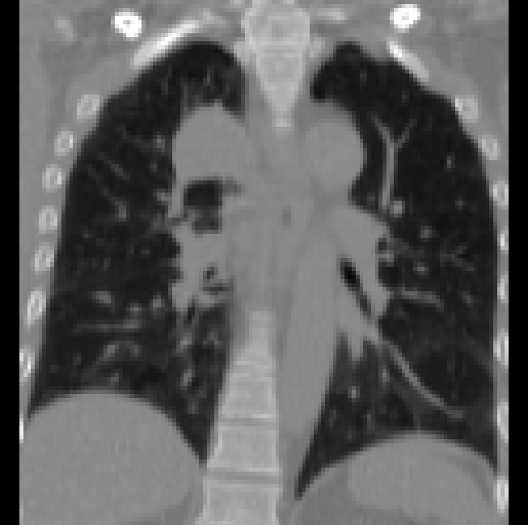

<p float="left">
  
   
</p>

<br><br><br>

# Patient Specific 4DCT

Work In progress

## Prerequisites
- Linux
- Python 3
- CPU or NVIDIA GPU + CUDA CuDNN

## Getting Started
### Installation

- Clone this repo:
```bash
git clone https://github.com/cyiheng/InProgress
cd InProgress
```

- Install dependencies:
```bash
pip install -r requirements.txt
```

### Download pretrained weight
Download a pre-trained model with `./scripts/download_pretrained_model.sh`.

```bash
bash ./scripts/download_pretrained_model.sh
```

### Datasets

As example, you can use the 4D-Lung dataset from The Cancer Imaging Archive.
```
Hugo, Geoffrey D., Weiss, Elisabeth, Sleeman, William C., Balik, Salim, Keall, Paul J., Lu, Jun, & Williamson, Jeffrey F. (2016). Data from 4D Lung Imaging of NSCLC Patients. The Cancer Imaging Archive. http://doi.org/10.7937/K9/TCIA.2016.ELN8YGLE
```

A Jupyter notebook is available to preprocess data into the input image format.
Before running the notebook, please check the following information:
- Fileformat supported: NifTI
- Filename: `LungCT_patient_phase.nii.gz (i.e: LungCT_0100_0005.nii.gz`)
- Initial files location: `./datasets/001_original/`
- Initial image orientation: RAI

- **NOTE:** We assume that the files are already convert from DICOM to NifTI format

The notenook needs the following tools:
- Lung segmentation : [lungmask](https://github.com/JoHof/lungmask)
- Image resampling  : [plastimatch](http://plastimatch.org/getting_started.html)
- Several operation is based on SimpleITK : [SimpleITK](https://github.com/SimpleITK/SimpleITKPythonPackage)

After running the notebook, the dataset directories should be like following if all 4D-lung dataset is used:
```text
./datasets
├── 000_csv
│   ├── body_bb.csv
│   ├── lung_bb.csv
│   └── final_bb.csv
├── 001_original
│   ├── body
│   │   └── ...
│   ├── lung
│   │   └── ...
│   ├── tumor
│   │   └── ...
│   ├── LungCT_0100_0000.nii.gz
│   ├── ...
│   └── LungCT_0119_0009.nii.gz
├── 002_bounding_box
│   ├── ...
│   └── LungCT_0119_0009.nii.gz
├── 003_isotrope
│   ├── ...
│   └── LungCT_0119_0009.nii.gz
├── 004_128x128x128
│   ├── ...
│   └── LungCT_0119_0009.nii.gz
└── imagesTs
```
The final images are in a shape of 128 x 128 x 128.
Please select the images you want to use as input for the model to the directory `imagesTs`


### Run Inference

- Test the model after download pretrained weight:
```bash
python ./test_3D.py --dataroot ./datasets/ --name pretrained_model --model test --dataset_mode test --num_test 1
```
- The test results will be saved by default in the directory : `./results/pretrained_model/`
- You can change the range of alpha with the following options: 
```bash
--alpha_min : the minimum value of the generated images (default: 0.0)
--alpha_max : the maximum value of the generated images (default: 1.0)
--alpha_step: the number of intermediate images between the range [alpha_min, alpha_max] (default: 5)
```
- **NOTE:** The minimum and maximum alphas values are 0.0 and 3.0 respectively. 

- You can select the loop mode for the final generated 4DCT: 
```bash
--loop : change how the 4DCT is stacked from the generated images
	0 : Only Source phase to alpha-inhale phase - [0,1,...,alpha]
	1 : Source to alpha-inhale phase and then add reversed images (alpha-inhale phase to source) - [0,1,...,alpha,...,2,1]
	2 : Same as 1, but with a step of 2, avoiding re-using a same image twice - [0,2,4,...,alpha,...,5,3,1]
```

- **NOTE:** For no GPU user, please add the option `--gpu_ids -1`, it will run on CPU instead.


## Citation
If you use this code for your research, please cite our papers.
```
TODO
```

## Acknowledgments
Our code is inspired by :
- [CycleGAN and pix2pix in Pytorch](https://github.com/junyanz/pytorch-CycleGAN-and-pix2pix).
- [vox2vox](https://github.com/enochkan/vox2vox)
