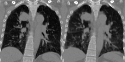
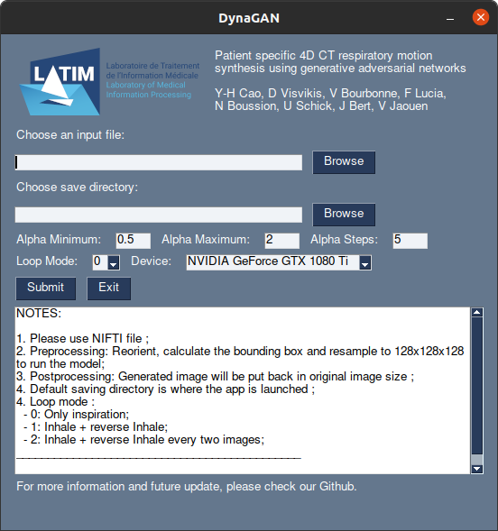
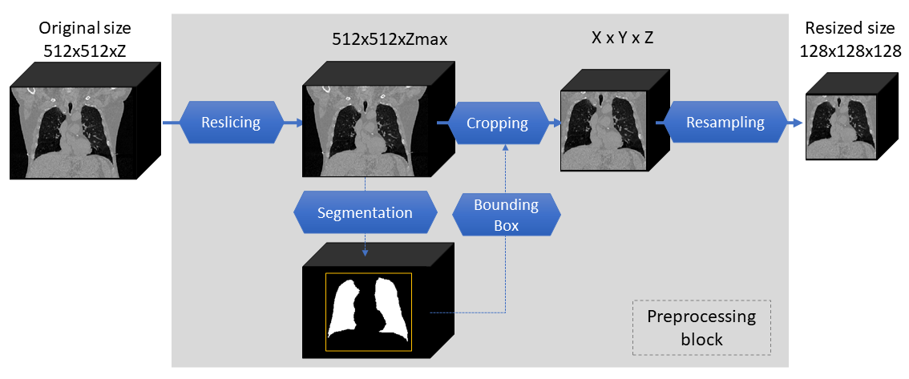

<br>
<p align="center">
  
</p>

# Dual supervised-unsupervised respiratory motion synthesis from static CT images using latent phase conditioning

Four-dimensional computed tomography (4DCT) consists in reconstructing an acquisition into multiple phases to track internal organ and tumor motion. It is commonly used in radiotherapy treatment planning but lead to higher doses of radiation, up to six times a conventional 3D CT scan. In this study, we propose a deep image synthesis method to generate pseudo respiratory CT phases from static images for motion-aware, 4DCT-free treatment planning. The model produces patient-specific deformation vector fields (DVFs) by conditioning synthesis on external respiratory traces. 

A key methodological contribution is to encourage DVF realism through supervised DVF training while using an adversarial term jointly not only on the warped image but also on the magnitude of the DVF itself. This way, we avoid excessive smoothness typically obtained through unsupervised deep learning registration, and encourage correlations between the respiratory amplitude and the generated image.

This repository shares source code to run inference and thus generate motion from a 3D CT image.

<p align="center">
  
</p>

If you use this code for your research, please cite our papers.
```
TODO
```

# Table of Contents
- [Intro](#dual-supervised-unsupervised-respiratory-motion-synthesis-from-static-ct-images-using-latent-phase-conditioning)
- [Table of Contents](#table-of-contents)
- [Ready-to-go](#ready-to-go)
- [Usage](#usage)
  - [Prerequisites](#prerequisites)
  - [Installation](#installation)
  - [Download pretrained weight](#download-pretrained-weight)
  - [Run inference](#run-inference)
  - [Datasets](#datasets)
    - [Preprocessing](#preprocessing)
    - [Postprocessing](#postprocessing)
- [Acknowledgements](#acknowledgements)


# Ready-to-go

We made a simple application to try out the model (~2.1GB).

> For [Windows user](https://ubocloud.univ-brest.fr/s/tqjfEe39Q3J8qyD)

> For [Linux user](https://ubocloud.univ-brest.fr/s/aL8yffHNjWYSNtm) 

<p align="left">
  
</p>

**NOTES:** 
- It can takes only one file at time (unlike the version in [Usage](#usage))
- The preprocessing is included in the application but might take some time to run depending of the image size, CPU and GPU.
- The postprocessing will put the generated image in the initial size:
  - No: Give only image in 128x128x128 ;
  - Low: Resampled generated image to initial size ;
  - High: Resample the deformation vector field to the initial space and then warp the original input image ;
- It doesn't need GPU, but it will take a longer time for preprocessing & generating phases.
- It takes some times to be launched, some warning might appear but nothing wrong. 

Information about runtime for <b>alpha steps of 5</b>:
<table class="center">
    <thead>
        <tr>
            <th>Device</th>
            <th>Size</th>
            <th>Preprocessing </th>
            <th>Generation </th>
            <th>Save 4DCT </th>
            <th>Total</th>
        </tr>
    </thead>
    <tbody>
        <tr>
            <td rowspan=2>GPU</td>
            <td>256 x 256 x 96</td>
            <td>≈ 10sec</td>
            <td>≈ 5sec</td>
            <td>≈ 10sec</td>
            <td>≈ 25sec</td>
        </tr>
        <tr>
            <td>512 x 512 x 117</td>
            <td>≈ 20sec</td>
            <td>≈ 10sec</td>
            <td>≈ 30sec</td>
            <td>≈ 70sec</td>
        </tr>
        <tr>
            <td rowspan=2>CPU</td>
            <td>256 x 256 x 96</td>
            <td>≈ 120sec</td>
            <td>≈ 20sec</td>
            <td>≈ 10sec</td>
            <td>≈ 160sec</td>
        </tr>
        <tr>
            <td>512 x 512 x 117</td>
            <td>≈ 120sec</td>
            <td>≈ 40sec</td>
            <td>≈ 30sec</td>
            <td>≈ 190sec</td>
        </tr>
    </tbody>
</table>

Those times are obtained with : 
- an NVIDIA GeForce GTX 1080Ti GPU with 11GB of memory (~5GB of GPU were used to generate images)
- an Intel I7-3930M @ 3.2GHz CPU

For more details about the alphas values and loop modes, please check [Run inference](#run-inference).

# Usage

## Prerequisites
- Linux
- Python 3
- CPU or NVIDIA GPU + CUDA CuDNN

## Installation

- Clone this repo:
```bash
git clone https://github.com/cyiheng/Dynagan
cd Dynagan
```

- Install dependencies:
```bash
pip install -r requirements.txt
```

## Download pretrained weight
Download a pre-trained model with `./scripts/download_pretrained_model.sh`.

```bash
bash ./scripts/download_pretrained_model.sh
```

## Run Inference

- Test the model after download pretrained weight:
```bash
python ./test_3D.py --dataroot ./datasets/ --name pretrained_model --model test --dataset_mode test --num_test 1
```
- The test results will be saved by default in the directory : `./results/pretrained_model/`
- You can change the range of alpha with the following options: 
```bash
--alpha_min : the minimum value of the generated images (default: 0.0)
--alpha_max : the maximum value of the generated images (default: 2.0)
--alpha_step: the number of intermediate images between the range [alpha_min, alpha_max] (default: 5)
```
- **NOTE:** The minimum and maximum alphas values are 0.0 and 3.5 respectively. 

- You can select the loop mode for the final generated 4DCT: 
```bash
--loop : change how the 4DCT is stacked from the generated images
	0 : Only Source phase to alpha-inhale phase - [0,1,...,alpha]
	1 : Source to alpha-inhale phase and then add reversed images (alpha-inhale phase to source) - [0,1,...,alpha,...,2,1]
	2 : Same as 1, but with a step of 2, avoiding re-using a same image twice - [0,2,4,...,alpha,...,5,3,1]
```

- **NOTE:** For no GPU user, please add the option `--gpu_ids -1`, it will run on CPU instead.

## Datasets

As example, you can use the 4D-Lung dataset from The Cancer Imaging Archive.
```
Hugo, Geoffrey D., Weiss, Elisabeth, Sleeman, William C., Balik, Salim, Keall, Paul J., Lu, Jun, & Williamson, Jeffrey F. (2016). Data from 4D Lung Imaging of NSCLC Patients. The Cancer Imaging Archive. http://doi.org/10.7937/K9/TCIA.2016.ELN8YGLE
```

### Preprocessing 

<p align="center">
  
</p>

A Jupyter notebook is available to **preprocess** data into the input image format.
Before running the notebook, please check the following information:
- Fileformat supported: NifTI
- Filename: `LungCT_patient_phase.nii.gz (i.e: LungCT_0100_0005.nii.gz)`
- Initial files location: `./datasets/001_original/`
- Initial image orientation: RAI

- **NOTE:** We assume that the files are already convert from DICOM to NifTI format

The notenook needs the following tools:
- Lung segmentation : [lungmask](https://github.com/JoHof/lungmask)
- Several operation is based on SimpleITK : [SimpleITK](https://github.com/SimpleITK/SimpleITKPythonPackage)

After running the notebook, the dataset directories should be like following if all 4D-lung dataset is used:
```text
./datasets
├── 000_csv
│   ├── body_bb.csv
│   ├── lung_bb.csv
│   └── final_bb.csv
├── 001_original
│   ├── body
│   │   └── ...
│   ├── lung
│   │   └── ...
│   ├── tumor
│   │   └── ...
│   ├── LungCT_0100_0000.nii.gz
│   ├── ...
│   └── LungCT_0119_0009.nii.gz
├── 002_bounding_box
├── 003_128x128x128
└── imagesTs
```
The final images are in a shape of 128 x 128 x 128.
Please select the images you want to use as input for the model to the directory `imagesTs`

### Postprocessing

A Jupyter notebook is available to **postprocess** data into the initial size if the **postprocess** was done by the section [above](#preprocessing).
The notebook will use the deformation vector field generated at [inference](#run-inference).

Please note that an example is given in the notebook but need to be modified depending of :
- The paths
- The input file used

# Acknowledgments
Our code is inspired by :
- [CycleGAN and pix2pix in Pytorch](https://github.com/junyanz/pytorch-CycleGAN-and-pix2pix).
- [vox2vox](https://github.com/enochkan/vox2vox)
